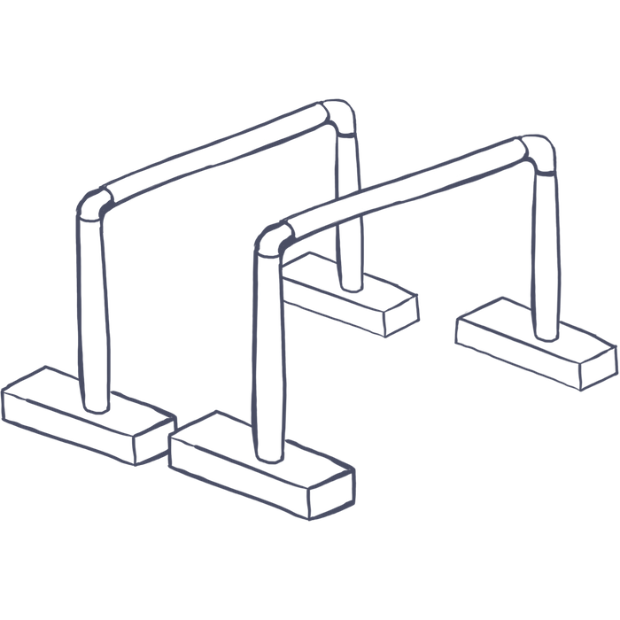

# parallettes

{ex}
(ns parallettes
  (:require [stylo.draw :refer :all]))
  
(load-file "chunk.clj")
(use 'stylo.chunk)

[:style "img {max-width: 100%;}"]
{ex}

Unless otherwise shown, all dimensions are in inches.

We have a gym at the back of a metal shop that we affectionately call *the bunker*. Slowly we are adding equipment. This document covers the design for a pair of parallette bars which are extremely fun to use for calistenics work.

## Design
Parallettes are simple bars that sit parallel to the ground, raised by a small amount. Very straight forward.

The bar should be about 1.5in thick and built with sturdy material to withstand a human's body weight swinging around.

The legs holding up the bar should be sturdy.

Just a note that the sketch above will not match the final design, it is just provided as a visual reference. My design will be using flatbar triangles instead.

{ex}
(def g-base-h 9)
(def g-base-w (* g-base-h (/ 2 (Math/sqrt 3))))
(def g-leg-t 0.25)
(def g-leg-w 2)
(def g-bar-d 1.5)
(def g-bar-r (/ g-bar-d 2))
(def g-bar-l 20)
(def g-bar-inset 0.5)
{ex}

## Legs
The legs would look quite nice as triangles, and we can make them easily by bending some flatbar. The top corner of the triangle should be cut off to provide a space to weld the leg and bar together.

{ex}
(def leg-outer-pts
  [[(/ g-base-w 2) 0]
   [g-base-w g-base-h]
   [0 g-base-h]])

(def leg-inner-pts
  (offset leg-outer-pts (- g-leg-t)))

(def loa (-line (first leg-outer-pts) (last leg-outer-pts)))
(def lob (-line (first leg-outer-pts) (second leg-outer-pts)))

(def lia (-line (first leg-inner-pts) (last leg-inner-pts)))
(def lib (-line (first leg-inner-pts) (second leg-inner-pts)))

(def loapt (loa (d->t loa g-bar-r)))
(def lobpt (lob (d->t lob g-bar-r)))

(def liapt (lia (d->t lia g-bar-r)))
(def libpt (lib (d->t lib g-bar-r)))
 
(def leg-pts
  [lobpt
   libpt
   (second leg-inner-pts)
   (last leg-inner-pts)
   liapt
   loapt
   (last leg-outer-pts)
   (second leg-outer-pts)])

(def leg
  (extrude- (polygon-2d leg-pts) g-leg-w))
(def tube
  (extrude- (mv- (regular-polygon g-bar-r 24) (first leg-outer-pts)) g-bar-l))

(def leg1
  (mv- leg [0 0 g-bar-inset]))
(def leg2
  (mv- leg [0 0 (- g-bar-l g-leg-w g-bar-inset)]))
(def asm
  (join leg1 leg2 tube))

(def leg-front-view-dimensioned
  (figure [720 500 20]
          "leg front view with dimensions"
          (mv [4 4]
              (draw-edges-recursive asm)
              (dimension [g-base-w g-base-h] [0 g-base-h])
              (dimension [(- g-base-w 0.00001) 0] [g-base-w g-base-h])
              (dimension (last leg-outer-pts) loapt))))

leg-front-view-dimensioned
{ex}

### Bending the Legs
To form the legs properly, first cut a slit with a grinding disk. Cut a Deep V for easier forming.

Once bent inward, weld the inner corner to hold the shape. You will want to grind fairly deep and quite wide to get a nice acute angle on the bend, but any mistakes are likely to be covered up with the weld anyway. Just jig the two legs together so that they hold the same shape.

{ex}
(def bend-detail-pts
  (let [gap 0.6]
    [[0 g-leg-t]
     [6 g-leg-t]
     [6 0]
     [(+ 3 (/ gap 2)) 0]
     [3 (* g-leg-t 0.8)]
     [(- 3 (/ gap 2)) 0]
     [0 0]]))

(def weld-detail
  (join leg
        (-> (regular-polygon 0.2 12)
            (extrude- g-leg-w)
            (mv- [(* 2.5 g-leg-t) (- g-base-h (* 2 g-leg-t)) 0]))
        #_(mv- (extrude- (regular-polygon 0.2 12) g-leg-w) [g-leg-t (- g-base-h g-leg-t) 0])))

(def bend-detail (extrude- (polygon-2d bend-detail-pts) g-leg-w))

(figure [720 300 80]
        "bend detail"
        (mv [0 1]
            (draw-edges-recursive bend-detail)))

(figure [720 300 80]
        "weld detail"
        (mv [1 -7]
            (draw-edges-recursive weld-detail)))

{ex}

## Bar
{ex}
[:p (str "The bar is a " g-bar-d "in diameter tube.")] 
{ex}

The legs are attached by welding them on the ends.

{ex}
(def leg-side-view-dimensioned
  (figure [720 720 20]
          "leg side view with dimensions"
          (mv [4 4]
              (dimension [0 0] [g-bar-l 0])
              (dimension [(+ g-bar-inset g-leg-w) g-base-h] [g-bar-inset g-base-h])
              #_(dimension [g-bar-inset g-bar-d] [0 g-bar-d] )
              (draw-edges-recursive (rot- asm [0 90 0])))))

leg-side-view-dimensioned
{ex}

.
.
.
.
.
.
.
.
.
.
.
.
.
.
.
.
.
.
.

